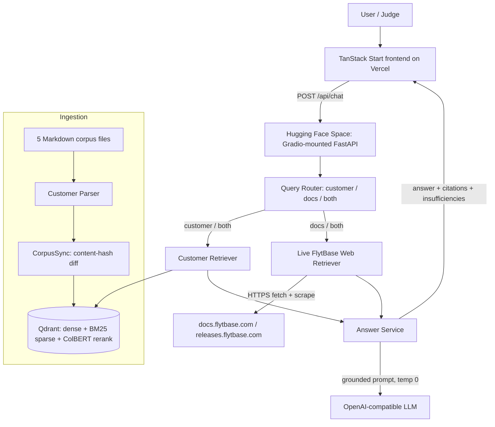

# Customer Intelligence Copilot — Instructions

A retrieval-augmented assistant that answers questions about FlytBase by combining a
private **customer corpus** (Qdrant vector store) with **live FlytBase documentation**
retrieval, grounded through an OpenAI-compatible LLM.

## Architecture



## Components

- **Frontend** — TanStack Start + React + TypeScript, deployed on Vercel. Calls
  `POST /api/chat` (and optionally `/api/corpus/sync`) on the backend.
- **Backend** — FastAPI app served on a Hugging Face **Gradio** Space. The Space SDK is
  Gradio (free tier), but the FastAPI API is mounted onto Gradio's underlying FastAPI
  app (`demo.app.include_router(...)`), so `/api/chat` and `/api/corpus/sync` work
  without a paid Docker Space.
- **Query router** — classifies each question as `customer`, `documentation`, or `both`.
- **Customer retriever** — hybrid search over the Qdrant collection (dense + BM25 sparse
  prefetch, ColBERT late-interaction rerank). Embeddings are computed by Qdrant Cloud
  Inference, so the backend stays lightweight.
- **Web retriever** — resolves doc URLs from FlytBase's official `llms.txt` index and
  fetches/scrapes the matching `docs.flytbase.com` / `releases.flytbase.com` pages.
- **Answer service** — builds a grounded prompt (temp 0) and returns the answer with
  citations and any evidence insufficiencies.

## Local backend

```bash
cd backend
python -m venv .venv && .venv\Scripts\activate
pip install -r requirements.txt
cp .env.example .env   # fill LLM_* and QDRANT_* secrets
uvicorn app.main:app --host 0.0.0.0 --port 8000
```

- Corpus indexing runs in the background on startup; the API is available immediately.
- The LLM client uses a 60s timeout so stalled model calls fail fast instead of hanging.
- The web retriever needs outbound internet to fetch `llms.txt` and the doc pages.

## Hugging Face Space (backend deploy)

1. Create a **Gradio** Space (free tier). Do not use the Docker SDK.
2. Clone it, copy `backend/app.py`, `backend/requirements.txt`, and the `backend/app/`
   package into the Space repo root. Commit the `se-dataset/` corpus folder too.
3. Set Space **Variables and Secrets**: `LLM_BASE_URL`, `LLM_API_KEY`, `LLM_MODEL`,
   `QDRANT_URL`, `QDRANT_API_KEY` (and optionally `CORPUS_DIR`).
4. Push. The Space auto-builds; once healthy, `GET /health` returns `{"status":"ok"}`.

## Notes / gotchas

- Docker Desktop can occupy port `8000` locally and break the frontend↔backend link —
  free the port before starting the backend.
- Qdrant Cloud Inference indexing is slow; it is intentionally backgrounded so startup
  is not blocked.
- CORS on the Gradio Space allows all origins, so the Vercel frontend can call the API
  directly.
