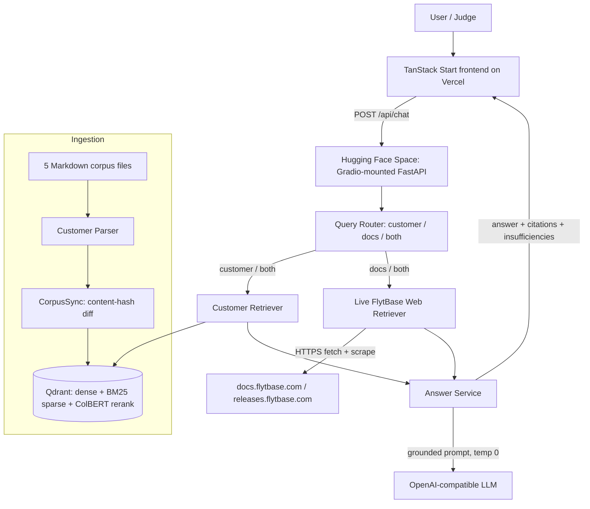

# Customer Intelligence Copilot — Project Document

**Subtitle:** A grounded, conversational knowledge base over customer data + live FlytBase documentation
**Deployment targets:** Frontend → Vercel · Backend → Hugging Face Spaces · Vector DB → Qdrant (Cloud, hybrid)

---

## System Architecture

**Component map**

| Layer | Technology | Notes |
|---|---|---|
| Frontend | TanStack Start (React 19, SSR), Tailwind v4, Radix UI | Builds to `.vercel/output`; `vercel.json` sets `outputDirectory` |
| Backend | FastAPI mounted on Gradio (`backend/app.py`) for HF free Spaces | CORS driven by `FRONTEND_ORIGIN` env |
| Vector DB | Qdrant Cloud (hybrid: `all-MiniLM-L6-v2` dense + `Qdrant/bm25` sparse + ColBERT `answerai-colbert-small-v1` rerank) | Activated by `QDRANT_URL`; embeddings via Qdrant Cloud Inference |
| Retrieval fallback | `InMemoryVectorStore` | Used when `QDRANT_URL` is empty (keyword overlap) |
| LLM | OpenAI-compatible chat completions, `temperature=0` | Configured via `LLM_BASE_URL` / `LLM_API_KEY` / `LLM_MODEL` |
| Live docs | `httpx` + BeautifulSoup, host-allowlisted to the two FlytBase domains | Fetched at query time, never stored |
| Grounding | Pydantic `Citation` validation + "insufficient evidence" guard | Every claim must cite a source id |

---

## A. Thought Process

1. **The real problem is grounding, not chat.** Answering across two disconnected sources is easy to fake and easy to get wrong. So we designed the system around *evidence first, generation last*.
2. **Separate the corpus from the model.** Customer records are parsed once into typed, provenance-preserving objects; the LLM never sees raw files, only retrieved snippets.
3. **Route before retrieve.** A lightweight keyword router decides whether a question needs customer data, live docs, or both — avoiding unnecessary calls and keeping answers on-topic.
4. **Hybrid retrieval for quality.** Combine dense semantic search, sparse BM25, and ColBERT late-interaction reranking so the right record surfaces even with odd phrasing.
5. **Hard guardrails.** If retrieval returns nothing, the system says "not enough information" instead of hallucinating. Web citations are validated to be HTTPS on the two allowed FlytBase hosts.
6. **Incremental, not rebuild.** Hash-diff the corpus on sync so updates appear immediately without re-indexing everything.
7. **Deploy cheaply and safely.** Frontend on Vercel (static/edge), backend on HF free Spaces (Gradio SDK), vector search on managed Qdrant — no private scraping of docs, no real customer data touched.

---

## B. Implementation so far

- **Backend (FastAPI)**
  - `customer_parser.py`: parses `accounts`, `issues`, `feature_requests`, `tasks`, `meeting_notes` into `CustomerRecord` objects with stable IDs.
  - `corpus_sync.py`: hash-diff sync (created / updated / deleted / unchanged) → `POST /api/corpus/sync`.
  - `query_router.py`: classifies questions into `customer` / `documentation` / `both`.
  - `customer_retriever.py` + `vector_store.py`: retrieval over in-memory or Qdrant.
  - `qdrant_store.py`: hybrid dense + sparse + ColBERT rerank via Qdrant Cloud Inference.
  - `flytbase_web.py`: live fetch + scrape of `docs.flytbase.com` / `releases.flytbase.com`, host-allowlisted.
  - `answer_service.py` + `llm_client.py`: grounding check + strict cited prompt to the LLM.
  - `app.py`: HF Spaces entrypoint (Gradio-mounted FastAPI, configurable CORS).
- **Frontend (TanStack Start)**
  - Chat panel, answer card (with "insufficient evidence" state), and a citation panel that splits **Customer Evidence** vs **Live FlytBase Evidence** with "Open live source" links.
  - Three preloaded demo questions matching the three required demo types.
  - Corpus "Sync" button wired to `/api/corpus/sync`.
  - `vercel.json` + Nitro `vercel` preset → produces `.vercel/output` (the Vercel fix).
- **Vector DB**
  - Qdrant hybrid store implemented and selected automatically when `QDRANT_URL` is set.

---

## C. Done so far (till 2026-08-15)

- ✅ Full backend logic: parsing, routing, retrieval, grounding, guardrails, sync.
- ✅ Frontend UI with citations, demo questions, and sync.
- ✅ Hybrid Qdrant retrieval path implemented.
- ✅ Frontend deploy-ready on **Vercel** (build verified; `vercel.json` added).
- ✅ Backend deploy-ready on **Hugging Face Spaces** (`app.py` Gradio mount; CORS via `FRONTEND_ORIGIN`).
- ✅ Qdrant wiring supported via environment variables.
- ✅ 16 backend tests (parse, retrieve, route, answer, demo flows, health).
- ⚠️ **Live doc URL discovery not yet wired** in the production path (`search_urls` defaults to empty) — see D.
- ⬜ Bonus features (contradiction checker, top-question analytics) not implemented.

---

## D. Reason for the issue

**1. Vercel "No Output Directory named 'dist' found"**
- *Cause:* the build used Nitro's `cloudflare-module` preset, which emits to `.output/`, not `dist/`. Vercel looked for `dist` and failed.
- *Fix applied:* switched the Nitro preset to `vercel` and added `vercel.json` with `outputDirectory: .vercel/output`. The build now produces the Vercel Build Output API structure (`.vercel/output` with `functions/`, `static/`, `config.json`).

**2. Live documentation retrieval currently returns nothing in production**
- *Cause:* `FlytBaseWebRetriever.search` needs a `search_urls` function to turn a question into candidate doc URLs. In the real container it is never injected, so it defaults to `lambda _: []` → no live pages are fetched, and doc-only / combined questions fall through to "insufficient evidence." Unit tests pass only because they inject fake URLs.
- *What's already there:* the fetch, scrape, and host-allowlist plumbing is complete — only the **URL discovery step** (e.g. reading the docs/releases sitemaps and ranking by keyword) is missing.
- *Impact:* for a fully live demo of the "docs-only" and "combined" questions, this must be wired, or the frontend can run in mock mode (`VITE_USE_MOCK_API=true`) which returns realistic cited answers.

**3. CORS (Render vs HF)**
- The Render entrypoint (`main.py`) hard-codes localhost CORS, but the **HF entrypoint (`app.py`) already uses `FRONTEND_ORIGIN`** and defaults to `*`. So once the Space secret `FRONTEND_ORIGIN` is set to the Vercel URL, cross-origin calls work. This is why the HF target is the correct one.

---

## E. How this project is helpful

**To the user / operator**
- One question replaces five tabs of manual lookup across customer records and docs.
- Every answer is traceable to a record ID or a live doc URL.
- Corpus updates appear instantly via sync — no rebuild.

**To FlytBase (the company)**
- **Faster, correct support:** e.g. *"Is geofencing supported?"* → checked live against docs → "Yes, here's the link," in seconds.
- **Catches contradictions:** e.g. a feature marked "requested/open" in customer data while release notes say "shipped" → the agent flags it, so FlytBase doesn't look outdated to the customer.
- **Always current:** reads docs/release notes live, so answers never go stale.
- **Safe & compliant:** only the provided corpus + two public FlytBase domains; no real customer data accessed.
- **Demand signal:** the question stream shows what customers ask most (e.g. "mission planning"), guiding docs/product fixes.
- **Scales cheaply:** one question stays ~same effort as the customer base grows.

---

**One-line summary for the cover:** *A grounded, cited Q&A copilot that unifies FlytBase's customer records and live public documentation — deployed on Vercel + Hugging Face + Qdrant.*